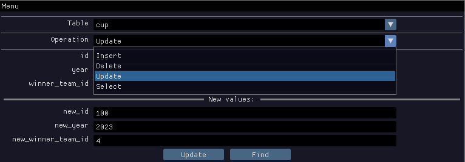

# DBMS

Tiny DBMS for managing data in MySQL DBs, implemented in C++.

## Installation

Clone project via

```bash
git clone https://github.com/Raspy-Py/DBMS.git
```

## Usage

### Choose table


### Choose mode



### Perform queries


## Contributing

Pull requests are welcome. For major changes, please open an issue first
to discuss what you would like to change.

Please make sure to update tests as appropriate.

## License

[MIT](https://choosealicense.com/licenses/mit/)
